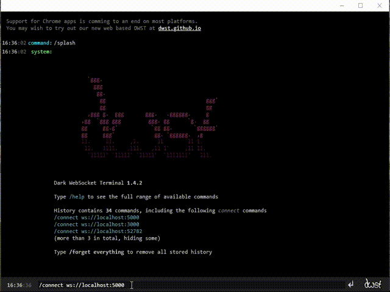

# Mass DNS Probe Service

[](https://www.codefactor.io/repository/github/acuciureanu/mass-dns-probe-service)

### Install packages
```sh
npm install
```

### Run the app
```sh
node app.js
```

### Trigger mass DNS probe

Connect to `ws://localhost:5000` with a websocket client.


